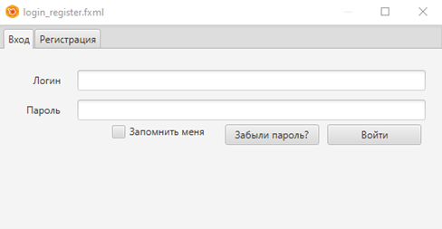

[На страницу с документацией](doc_main.md)
# Требования к ПО
<details>
<summary>Функцинальная специкация</summary>
| Id                    | Описание                                                                                                                                                                                                                                                                                 | Статус      |
| --------------------- | ---------------------------------------------------------------------------------------------------------------------------------------------------------------------------------------------------------------------------------------------------------------------------------------- | ----------- |
| Start_1               | Первое открывающаяся форма будет содержать 2 вкладки: "Вход", "Регистрация".                                                                                                                                                                                                             | Реализовано |
| Start_2               | После запуска клиента открывается форма для входа и регистрации по умолчанию открыта вкладка "Вход".                                                                                                                                                                                     | Реализовано |
| Exit_1                | Ввиду особенностей реализации на в верхней правой части  всех форм будет иметься кнопка "x".                                                                                                                                                                                             | Реализовано |
| Exit_2                | Нажатие на данную кнопку будет приводить к закрытию текущей формы и открытию предыдущей.                                                                                                                                                                                                 | Реализовано |
| Exit_3                | Требование "Exit_2" не относиться к форме входа и авторизации. При её нажатии на даннйо форме будет произвдено закртие приложения.                                                                                                                                                       | Реализовано |
| Image_1               | Требования к файлу: мин разрежение 200\*200 максимальное разрешение1000\*1000, форматы png jpeg.                                                                                                                                                                                         | Реализовано |
| Image_2               | Допустимые форматы изображений png, jpeg, bmp.                                                                                                                                                                                                                                           |             |
| Username_1            | Логин пользователя должен содержать от 1 до 50 символов.                                                                                                                                                                                                                                 | Реализовано |
| Username_2            | Логин пользователя должен состоять из букв кириллицы, латиницы, арабских цифр и спец. символов (- .).                                                                                                                                                                                    |             |
| Mail_1                | Длина почты от 3 до 129 символов.                                                                                                                                                                                                                                                        | Реализовано |
| Mail_2                | Локальная часть email должна состоять из 1-64 символов допустимых в логинах(см. Username_2). Доменная часть email может содеражть от 1-64 вышеназванных символов.                                                                                                                        | Реализовано |
| Password_1            | Пароль должен быть не менее 8 и не более 128 символов в длину.                                                                                                                                                                                                                           | Реализовано |
| Password_2            | Должен состоять только из букв кириллицы, латиницы, арабских цифр и спец. символов (! # $ % ( ) - _ . [ ] \ / ?).                                                                                                                                                                        | Реализовано |
| Password_3            | Пароли не должны храниться в чистом виде в базе данных.                                                                                                                                                                                                                                  | Реализовано |
| Chat_Name_1           | Название чата должно содержать от 1 до 50 символов.                                                                                                                                                                                                                                      | Реализовано |
| Chat_Name_2           | Название чата должно состоять из букв кириллицы, латиницы, арабских цифр, спец. символов (- . , ! ? ( ) пробел).                                                                                                                                                                         | Реализовано |
| Chat_Name_3           | Название чата не может состоять только из пробельных символов, а также содержать пробельные символы в начале и конце.                                                                                                                                                                    | Реализовано |
| Register_1            | Вкладка регистрации имеет поля логин, пароль, email, кнопку “Зарегистрироваться”.                                                                                                                                                                                                        | Реализовано |
| Register_2            | Если хотя бы 1 из полей (Логин, Пароль, email) не были заполнены, то кнопка “Зарегистрироваться” неактивна.                                                                                                                                                                              | Реализовано |
| Register_3            | При несоблюдении требований к вводимым данным вывести пользователю сообщение ошибки.                                                                                                                                                                                                     | Реализовано |
| Register_4            | На одну почту должна быть зарегистрирована только 1 УЗ.                                                                                                                                                                                                                                  | Реализовано |
| Register_5            | У разных УЗ должны быть разные логины.                                                                                                                                                                                                                                                   | Реализовано |
| Register_6            | При успешной регистрации перейти к основной форме мессенджера.                                                                                                                                                                                                                           | Реализовано |
| Register_7            | При нажатии кнопки зарегистрироваться производиться регистрация пользователя.                                                                                                                                                                                                            | Реализовано |
| Register_8            | При выборе “Запомнить меня”, в течение месяца на данном устройстве пользователь может авторизоваться без ввода данных.                                                                                                                                                                   | Реализовано |
| Login_1               | Вкладка входа имеет поля логин и пароль, кнопки “Войти”, “Забыли пароль?”.                                                                                                                                                                                                               | Реализовано |
| Login_2               | По нажатию кнопки "Войти" будет производиться авторизация.                                                                                                                                                                                                                               | Реализовано |
| Login_3               | Если хотя бы 1 из полей (логин, пароль) пустое, кнопка “Войти” неактивна.                                                                                                                                                                                                                | Реализовано |
| Login_4               | При возникновении ошибки авторизации вывести сообщение с текстом ошибки пользователю.                                                                                                                                                                                                    | Реализовано |
| Login_5               | При успешной авторизации перейти к основной форме мессенджера.                                                                                                                                                                                                                           | Реализовано |
| Login_6               | Если поле логин пустое, кнопка “Забыли пароль?” неактивна.                                                                                                                                                                                                                               | Реализовано |
| Login_7               | По нажатию кнопки “Забыли пароль?” будет произведён запрос на существоание УЗ с данным логином.                                                                                                                                                                                          | Реализовано |
| Login_7.1             | В случае успеха будет открыто окно "Забыли пароль".                                                                                                                                                                                                                                      | Реализовано |
| Login_7.2             | В случае неудачи будет выведено сообщение об ошибке.                                                                                                                                                                                                                                     | Реализовано |
| Forget_Password_1     | На данном окне будет поле для ввода email, а также кнопка "Подтвердить".                                                                                                                                                                                                                 | Реализовано |
| Forget_Password_2     | При нажатии кнопки "Подтвердить" будет произведена проверка введённого email.                                                                                                                                                                                                            | Реализовано |
| Forget_Password_2.1   | Если учётная запись привязана к данному email, то будет произведена попытка отправки письма на данный адресс.                                                                                                                                                                            | Реализовано |
| Forget_Password_2.1.1 | В случае успеха, пользовательский пароль будет сброшен, а в почтой ящик придёт письмо с временным паролем.                                                                                                                                                                               | Реализовано |
| Forget_Password_2.1.2 | В случае неудачи, будет выведено ссобщение об ошибке.                                                                                                                                                                                                                                    | Реализовано |
| Forget_Password_2.2   | Если введённый email не привязан к выбраннйо УЗ, то будет выведено сообщение об ошибке.                                                                                                                                                                                                  | Реализовано |
| Login_8               | Если поле логин пустое, то кнопка “забыли пароль” будет неактивна.                                                                                                                                                                                                                       | Реализовано |
| Login_9               | При ошибке запроса данных вывести сообщение об ошибке пользователю.                                                                                                                                                                                                                      | Реализовано |
| Chat_1                | В верхней левой части данной формы будут присутсвовать кнопки "Выйти", "+","Профиль", выпадающий список с локализацией, поле для поиска чатов по названию, ниже будет располагаться  список чатов. В правой нижней части экрана имеется большое поле для ввода и кнока "Отправить".      | Реализовано |
| Chat_2                | При нажатии на чат/диалог в правой части страницы появиться список сообщений диалога с пользователем.                                                                                                                                                                                    | Реализовано |
| Chat_3                | Чаты/диалоги с пользователями будут отсортированы в порядке убывания даты последнего сообщения.                                                                                                                                                                                          | Реализовано |
| Chat_4                | При нажатии кнопки “+” открывается форма создания нового чата.                                                                                                                                                                                                                           | Реализовано |
| Create_Chat_1         | Форма создания нового чата содержит поле для ввода логина пользователя, кнопку “Добавить пользователя” а также поле с названием чата и кнопку “Создать чат”, а также список добавленных пользователей.                                                                                   | Реализовано |
| Create_Chat_2         | Будущий создатель чата сам в списке не присутсвует и при попытке его добавления будет выведено сообщение об ошибке.                                                                                                                                                                      | Реализовано |
| Create_Chat_3         | Если поле “Название чата” не заполнено, то кнопка “Создать чат” неактивна                                                                                                                                                                                                                | Реализовано |
| Create_Chat_4         | При нажатии на кнопку удаления пользователя рядом с 1 из элементов списка пользователей, пользователь удаляется из списка.                                                                                                                                                               | Реализовано |
| Create_Chat_5         | Если поле с логином пустое, то кнопка “Добавить пользователя” неактивна.                                                                                                                                                                                                                 | Реализовано |
| Create_Chat_6         | При нажатии кнопки “Добавить пользователя” происходит проверка наличия УЗ пользователя.                                                                                                                                                                                                  | Реализовано |
| Create_Chat_6.1       | При возникновении ошибок добавления пользователя вывести сообщение об ошибке.                                                                                                                                                                                                            | Реализовано |
| Create_Chat_6.2       | В ином случае пользователь добавляется в список.                                                                                                                                                                                                                                         | Реализовано |
| Create_Chat_8         | В списке пользователей УЗ не дублируются(это также касается и УЗ будущего создателя).                                                                                                                                                                                                    | Реализовано |
| Create_Chat_9         | При нажатии на кнопку “Создать чат” будет создан чат с указанным списком пользователей и его создателем.                                                                                                                                                                                 | Реализовано |
| Create_Chat_10        | После создания нового чата создатель становится Администратором.                                                                                                                                                                                                                         | Реализовано |
| Chat_5                | При нажатии ПКМ на чате открывается контекстное меню с кнопками «Выйти из чата», «Настройки чата».                                                                                                                                                                                       | Реализовано |
| Chat_5.1              | При нажатии кнопки “Выйти из чата”, он удаляется из списка диалогов и чатов, а пользователь удаляется из списка чата.                                                                                                                                                                    | Реализовано |
| Chat_5.1.1            | Если пользователь был единственным администатором, то по прицнипу лотереи 1 из оставшихся пользователей станет новым Администратором.                                                                                                                                                    | Реализовано |
| Chat_5.1.2            | Если в чате больше не осталось пользователей, то запись о нём удаляется.                                                                                                                                                                                                                 | Реализовано |
| Chat_5.2              | При нажатии кнопки “Настройки чата” открывается форма с настройками чата                                                                                                                                                                                                                 | Реализовано |
| Chat_6                | При вводе текста в поле для поиска отображаются чаты с названиями имеющими в начале содержимое поля для поиска.                                                                                                                                                                          | Реализовано |
| Chat_Conf_1           | Форма для настройки чата содержит 2 вкладки: "Приглашение пользователей", "Список группы".                                                                                                                                                                                               | Реализовано |
| Chat_Conf_2           | По умолчанию у всех пользователей открыта вкладка "Приглашение пользователей".                                                                                                                                                                                                           | Реализовано |
| Chat_Conf_3           | Если пользователь не является администратором выбранного чата, то вкладка "Список группы" не будет отображаться.                                                                                                                                                                         | Реализовано |
| Chat_Conf_4           | Вкладка "Приглашение пользователей" содержит поле для ввода логина пользователя, кнопку “Добавить пользователя” а также label с названием чата и кнопку “Добавить пользователей”, а также список добавленных пользователей.                                                              | Реализовано |
| Chat_Conf_5           | Поведение данной части формы будет аналогично таковому для формы создания чата(см. требованиям Create_Chat_2-9). При этом значения пар: кнопок "Создать чат"-"Добавить пользователей", создатель чата - пользователь открыший окно настрйоки чата можно отождествить в данном контексте. | Реализовано |
| Chat_Conf_6           | При попытке добавления пользователя данного чата в список на добавление, требуется вывести сообщение об ошибке и не добвлять его в список.                                                                                                                                               | Реализовано |
| Chat_Conf_7           | Администратору доступны вкладки списка группы.                                                                                                                                                                                                                                           | Реализовано |
| Chat_Conf_8           | Вкладка "Список группы", содержит список логинов польщователей чата.                                                                                                                                                                                                                     | Реализовано |
| Chat_Conf_9           | Рядом с каждым полем списка есть пара check box-ов: “Исключить”,” Назначить Администратором”, под списком будет кнопка “Подтвердить”.                                                                                                                                                    | Реализовано |
| Chat_Conf_10          | Для пользователей с правами из данного списка Администратора  check box-ы недоступны.                                                                                                                                                                                                    | Реализовано |
| Chat_Conf_10          | Из пары check-box может быть активирован максимум 1 элемент.                                                                                                                                                                                                                             | Реализовано |
| Chat_Conf_11          | При нажатии кнопки “Подтвердить” данные check box-ов проверяются.                                                                                                                                                                                                                        | Реализовано |
| Chat_Conf_11.1        | Пользователи, рядом с логинами которых был активен check box “Исключить”, удаляется из списка группы, а также данный чат удаляется из их списка диалогов/чатов.                                                                                                                          | Реализовано |
| Chat_Conf_11.2        | Пользователи, рядом с логинами которых был активен check box “азначить Администратором”, получает права Админимтратора в данном диалоге/чате.                                                                                                                                            | Реализовано |
| Message_1             | Кнопка отправить активна только при наличии текста для отправки                                                                                                                                                                                                                          | Реализовано |
| Message_2             | Сообщение должно содержать не более 512 символов, при попытке ввода большего числа текстовое поле не будет их записывать.                                                                                                                                                                | Реализовано |
| Message_3             | При нажатии кнопки "Отправить" содержимое текстового поля с сообщениями будет отправлено в чат/диалог.                                                                                                                                                                                   | Реализовано |
| Message_4             | При нажатии пкм на сообщении доступны удаление и пересылка сообщений, ответ на сообщения.                                                                                                                                                                                                | Реализовано |
| Message_5             | Пользователь может удалять и редактировать только свои сообщения.                                                                                                                                                                                                                        | Реализовано |
| Delete_Message_1      | При нажатии кнопки удалить, выделенное сообщение удаляется для всех пользователей.                                                                                                                                                                                                       | Реализовано |
| Edit_Message_1        | При нажатии кнопки "Редактировать" текст выбранного сообщения появляется в текстовом поле, а кнопка отправить заменяется на кнопку "Отредактировать".                                                                                                                                    | Реализовано |
| Edit_Message_2        | При нажатии кнопки "Отредактировать", текст из текстового поля будет перенесён в выделенное сообщение, а также будет выставлен статус "ред.".                                                                                                                                            | Реализовано |
| Edit_Message_3        | Если содержимое поля с текстом совпадает с текстом сообщения для редактирования или данное поле пустое, то кнопка «Отредактировать» неактивна.                                                                                                                                           | Реализовано |
| Edit_Message_4        | При нажатии кнопки escape производиться выход из режима редактирования.                                                                                                                                                                                                                  | Реализовано |
| Forward_Message_1     | При выборе у сообщения опции переслать открывается форма переслыки сообщения.                                                                                                                                                                                                            | Реализовано |
| Forward_Message_2     | Форма переслыки сообщения будет содержать поле для поиска, список чатов, а также кнопку "Переслать".                                                                                                                                                                                     | Реализовано |
| Forward_Message_3     | Элементы списка можно выбирать посредством нажатия лкм на них.                                                                                                                                                                                                                           | Реализовано |
| Forward_Message_4     | Если ни один из элементов списка не выбран, то кнопка "Переслать" неактивна.                                                                                                                                                                                                             | Реализовано |
| Forward_Message_5     | При нажатии на кнопку "Переслать" выбранное ранее сообщение будет отправлена в выделенный в даннйо форме чат. При этом у данного сообщения будет отображено, изначальный его автор, а также то, что его переслал искомы пользователь.                                                    | Реализовано |
| Localization_1        | При нажатии на выпадающий список будут доступны опции с английским и русским языком.                                                                                                                                                                                                     | Реализовано |
| Localization_2        | При выборе новой( выбранный язык не соответствует текущему) опции из списка будет выведено диалогове окно.                                                                                                                                                                               | Реализовано |
| Localization_2.1      | На данном окне будет присутствовать сообщение следующего характера"изменения вступят в силу после перезагрузки приложения", а также кнопки "Ок".                                                                                                                                         | Реализовано |
| Localization_2.2      | Нажатие на кнопку "Ок" приведёт к мгновенному закрытию приложения.                                                                                                                                                                                                                       | Реализовано |
| LogOut_1              | Поведение кнопки "Выйти", аналогично таковому для кнопки "x".                                                                                                                                                                                                                            | Реализовано |
| Profile_1             | При нажатии кнопки "Профиль",пользователь перейдёт на форму с его профилем.                                                                                                                                                                                                              | Реализовано |
| Profile_2             | На данной форме отображается аватар пользователя, рядом кнопка "Поменять аватар", label с логином пользователя, также блоки элементов для смены email и смены пароля, в нижней части страниы будет располагаться кнопка "Вернуться к чатам".                                             | Реализовано |
| Profile_3             | При нажатии на кнопку "Поменять аватар" открывается окно, в котором указывается путь до локального файла новой аватара, снизу кнопка "Подтвердить".                                                                                                                                      | Реализовано |
| Profile_3.1           | При нажатии на кнопку «Подтвердить» производиться проверка выбранного изобрадения на требование Image_1.                                                                                                                                                                                 | Реализовано |
| Profile_3.1.1         | При несоответствие изображения требованиям,  следует вывести сообщение об ошибке.                                                                                                                                                                                                        | Реализовано |
| Profile_3.1.2         | В ином случае аватар пользователя измениться на новый.                                                                                                                                                                                                                                   | Реализовано |
| Change_Email_1        | В данном блоке отображается label с текущей почтой, рядом поле для ввода новой почты и кнопка "Сменить email", при нажатии и несоблюдении формата почты выдается сообщение об ошибке.                                                                                                    | Реализовано |
| Change_Email_2        | Если поле с новой почтой пустое или новая почта та же, что и старая, кнопка "Сменить email" неактивна.                                                                                                                                                                                   | Реализовано |
| Change_Email_4        | Нажатие на кнопку "Сменить email" инициирует его проверку на соответствие требованиям к email.                                                                                                                                                                                           | Реализовано |
| Change_Email_4.1      | При несоответствие требований к email, данное нажатие приведёт к выводу сообщения об ошибке.                                                                                                                                                                                             | Реализовано |
| Change_Email_4.2      | В ином случае email пользователя будет изменён и отобразиться в исходном label.                                                                                                                                                                                                          | Реализовано |
| Change_Password_1     | В данном блоке будут иметься три следующих поля: поле для ввода текущего пароля, поле для ввода нового пароля и поле для подтверждения нового пароля. Рядом будет находиться  кнопка "Сменить пароль".                                                                                   | Реализовано |
| Change_Password_2     | Кнопка "Сменить пароль" не активна , если хотя бы одно из полей для ввода пустое.                                                                                                                                                                                                        | Реализовано |
| Change_Password_3     | Нажатие на кнопку "Сменить пароль" инициирует проверку содержимого всех трёх полей.                                                                                                                                                                                                      | Реализовано |
| Change_Password_3.1   | Ошибка возникает в одном из следующих случаев: введённые данные не соотвествтуют требованиям к паролям, старый пароль введён неврно, новые пароли не совпадают. При это пользователь получит окно с соответствующим текстом ошибки.                                                      | Реализовано |
| Change_Password_3.2   | В ином случае пароль будет успешно изменён.                                                                                                                                                                                                                                              | Реализовано |
| Profile_5             | Нажати на кнопку "Вернуться к чатам" приведёт к закрытию данный формыи возвращению к основнйо формы с чатами.                                                                                                                                                                            | Реализовано |
</details>

## High level design
## Схема базы данных


В бд месенджера также будет хранитьс таблица для хранения токенов remember-me, которая будет контролироваться через Spring Security:
```sql
create table if not exists persistent_logins (  
    username varchar_ignorecase(100) not null,  
    series varchar(64) primary key,  
    token varchar(64) not null,  
    last_used timestamp not null 
    );
```

И отдельная таблица для хранения даты создания токена для пользователя, эти данные вынесены отдельно чтобы не усложнять оригинальную реализацию этой функциональности, для которой нужна выше приведенная таблица.
## Описание контекста spring
Бины для логики приложения:
- Репозитории (Spring Data JPA) для сущностей из БД
- Контроллеры, реализующие описанные ниже эндпоинты
- Промежуточные сервисы между репозиториями и контроллерами
- Бин отправки email

Настраиваемые бины Spring Security:
- SecurityConfig
- PasswordEncoder
- ApplicationUserService (UserDetailsService)
- AuthenticationManager
- PersistentTokenRepository
- DaoAuthenticationProvider
- SecurityFilterChain
## API

### Авторизация и регистрация
|     Endpoint      | Тип   | Парметры                                          | Возвращаемые значения | Коды возврата                                                                                                                                        |
| --------------- | --- | ------------------------------------------------- | ------------------- | ---------------------------------------------------------------------------------------------------------------------------------------------------- |
|  Is_user_present  | GET   | login (string)                                    | is_present (boolean)  | 200 – информация найдена успешно, 500 – ошибка сервера                                                                                               |
|   Is_email_used   | GET   | email (string)                                    |   is_used (boolean)   | 200 – информация найдена успешно, 500 – ошибка сервера                                                                                               |
|     Register      | POST  | login (string), email (string), password (string) |           -           | 200 – успешная регистрация, 500 – ошибка сервера                                                                                                     |
| Check_user_email  | POST  | login (string), email (string)                    |           -           | 200 – данная почта привязана к УЗ, 401 – пользователь не авторизован, 404 – пользователь с таким логином или имейл не найдены, 500 – ошибка сервера. |
| Send_tmp_password | PATCH | login (string), language (string, enum value)     |           -           | Коды: 200 – успешная отправка временного пароля, 401 – пользователь не авторизован, 500 – ошибка сервера.                                            |
|     Get_login     | GET   | login (string), email (string), password (string) |           -           | 200 – успешная регистрация, 401 – пользователь не авторизован, 500 – ошибка сервера                                                                  |
### Чаты
|        Endpoint        | Тип    | Парметры                                                                                                | Возвращаемые значения                                                   | Коды возврата                                                                                                                                                                                 |
| ---------------------- | ------ | ------------------------------------------------------------------------------------------------------- | ----------------------------------------------------------------------- | --------------------------------------------------------------------------------------------------------------------------------------------------------------------------------------------- |
|       Get_chats        | GET    | login (string), page_number (long)                                                                      | list_of_chats (list of Chats – chat_id – long, chat_name – string)      | 200 – информация найдена успешно, 400 – для указанной страницы нет чатов, 401 – пользователь не авторизован, 404 – пользователь с таким логином не найден, 500 – ошибка сервера.              |
|  Get_chats_by_search   | GET    | login (string), begin (string), page_number (long).                                                     | list_of_chats (list of Chats – chat_id – long, chat_name – string)      | 200 – информация найдена успешно, 400 – для указанной страницы нет чатов, 401 – пользователь не авторизован, 404 – пользователь с таким логином не найден, 500 – ошибка сервера               |
|    Get_chat_members    | GET    | chat_id (long)                                                                                          | list_of_users (list of Chat_users – login – string, is_admin – boolean) | 200 – информация найдена успешно, 401 – пользователь не авторизован, 404 – чат с таким id не найден, 500 – ошибка сервера                                                                     |
|      Create_chat       | POST   | chat_name (string), list_of_users (list of strings – logins), admin (string – login), language (string) | -                                                                       | 200 – успешное создание чата, 401 – пользователь не авторизован, 404 – пользователь с таким логином не найден, 500 – ошибка сервера                                                           |
|      Delete_chat       | DELETE | chat_id (long)                                                                                          | -                                                                       | 200 – успешное удаление чата, 401 – пользователь не авторизован, 404 – пользователь с таким логином не найден, 500 – ошибка сервера                                                           |
| Delete_users_from_chat | PATCH  | login (string), email (string), password (string)                                                       | -                                                                       | 200 – успешное удаление пользователей, 401 – пользователь не авторизован, 404 – чат с таким id не найден или пользователь с таким логином не найден, 500 – ошибка сервера                     |
| Add_users_to_chat<br>  | PATCH  | chat_id (long), list_of_users (list of strings – logins)                                                | -                                                                       | 200 – успешное добавление пользователей, 401 – пользователь не авторизован, 404 – чат с таким id не найден или пользователь с таким логином не найден, 500 – ошибка сервера                   |
|   Make_users_admins    | PATCH  | chat_id (long), list_of_users (list of strings – logins)                                                | -                                                                       | 200 – успешное назначение пользователей администраторами , 401 – пользователь не авторизован, 404 – чат с таким id не найден или пользователь с таким логином не найден, 500 – ошибка сервера |
### Сообщения
| Endpoint         | Тип   | Парметры                                                                       | Возвращаемые значения                                                                                                                                                                      | Коды возврата                                                                                                                                                                                                |
| ---------------- | ----- | ------------------------------------------------------------------------------ | ------------------------------------------------------------------------------------------------------------------------------------------------------------------------------------------ | ------------------------------------------------------------------------------------------------------------------------------------------------------------------------------------------------------------ |
| Get_messages<br> | GET   | chat_id (long), page_count (long)                                              | list_of_messages (list of Messages – message_id – long, sender_login – string, author_login – string, content – string, is_deleted – boolean, is_edited – boolean, is_forwarded - boolean) | 200 – информация найдена успешно, 400 – для указанной страницы нет сообщений, 401 – пользователь не авторизован, 404 – чат с таким id не найден, 500 – ошибка сервера                                        |
| Send_message     | POST  | sender_login (string), author_login (string), chat_id (long), content (string) | -                                                                                                                                                                                          | 200 – успешная отправка сообщения, 401 – пользователь не авторизован, 404 – чат с таким id не найден или пользователь с таким логином не найден, 500 – ошибка сервера                                        |
| Delete_message   | PATCH | message_id (long)                                                              | -                                                                                                                                                                                          | 200 – успешное удаление сообщения, 401 – пользователь не авторизован, 404 – сообщение с таким id не найдено, 500 – ошибка сервера.                                                                           |
| Forward_message  | POST  | message_id (long), sender_login (string), chat_id (long)                       | -                                                                                                                                                                                          | 200 – успешная пересылка сообщения, 401 – пользователь не авторизован, 404 – сообщение с таким id не найдено, или пользователь с таким логином не найден, или чат с таким id не найден, 500 – ошибка сервера |
| Edit_message     | PATCH | message_id (long), new_content (string)                                        | -                                                                                                                                                                                          | 200 – успешное обновление сообщения, 401 – пользователь не авторизован, 404 – сообщение с таким id не найдено, 500 – ошибка сервера                                                                          |
### Профиль
| Endpoint              | Тип  | Парметры                                    | Возвращаемые значения                                           | Коды возврата                                                                                                                              |
| --------------------- | ---- | ------------------------------------------- | --------------------------------------------------------------- | ------------------------------------------------------------------------------------------------------------------------------------------ |
| Get_profile_photo<br> | GET  | login (string)                              | profile_image (string)                                          | 200 – информация найдена успешно, 401 – пользователь не авторизован, 404 – пользователь с таким логином не найден, 500 – ошибка сервера    |
| Update_profile_photo  | POST | login (string), new_profile_image  (string) | -                                                               | 200 – изображение успешно обновлено, 401 – пользователь не авторизован, 404 – пользователь с таким логином не найден, 500 – ошибка сервера |
| Get_user              | GET  | login (string)                              | user (User – login – string, email – string, password – string) | 200 – информация найдена успешно, 401 – пользователь не авторизован, 404 – пользователь с таким логином не найден, 500 – ошибка сервера    |
| Update_email          | POST | login (string), new_email (string)          | -                                                               | 200 – почта успешно обновлена, 401 – пользователь не авторизован, 404 – пользователь с таким логином не найден, 500 – ошибка сервера       |
| Update_password       | POST | login (string), new_password (string)       | -                                                               | 200 – информация успешно обновлена, 401 – пользователь не авторизован, 404 – пользователь с таким логином не найден, 500 – ошибка сервера  |


## Пользовательский интерфейс
Вкладка вода на 1 форме:

Вкладка регистрации на 1 форме:


Основная форма с чатами и сообщениями:
![[images/dialogues.png]]
Окно пересылки сообщений:
![[images/forwarding.png]]
Окно создания чата:
![[create_chat.png]]
Окно настроек чата вкладка с добавлением пользователей:
![[configure_chat.png]]
Окно настроек чата вкладка со спиком группы:
![[configure_chat_list.png]]
Профиль пользователя:
![[profile.png]]
## Диаграмма контроллеров JavaFX, используемых в клиентском приложении
![[javafx_controllers.png]]