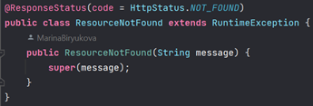

[На страницу с документацией](doc_main.md)
# Описание процедур тестирования
## Модульное тестирование
### Требования к процедуре  
1. Обеспечить тестовое покрытие кодовой базы всего проекта более 80%.
2. Необходимо применить несколько различных техник тест-дизайна
3. Сборка и запуск тестов должна производиться автоматически при сборке проекта тем при помощи системы сборки apache maven.
## Стек технологий 

1. JUnit 5 – фреймворк, предназначенный для автоматического тестирования программ. Основное назначение – unit-тестирование.
2. TestFX - фрейворк для тестирования JavaFx приложений. Применяется вместе с JUnit для инциализации и взаимодействия с UI мессенджера.
3. Mockito – фреймворк, позволяющий создавать тестовые mock-объекты в автоматизированных модульных тестах.
4. WireMock – библиотека для создания HTTP заглушек над веб-сервисами.

### Результаты тестирования

Всего с использованием различных техник тест-дизайна было написано 116 модульных тестов для бэкенда и 109 модульных тестов для клиента.

Ниже приведены отчёты с тесовым покрытием кода данными тестами для бэкенда:

Для клиента:

### Применяемые техники тестирования
#### Причина и следствие
Представляет собой простую проверку базовых действий и их результата.

Согласно спецификации, при вводе логина, не соответствующего прописанному формату, пользователю выводится сообщение об ошибке. Ниже представлен тест, в котором в поле вводится логин, не соответствующий требуемому формату, и происходит проверка появления ошибки и корректности сообщения.

#### Граничные значения

При анализе граничных значений данные группируются по эквивалентным классам, и проверяются только значения на границах классов.

При запросе списка чатов пользователя одним из параметров является номер страницы списка. Так как количество чатов на одной странице – 20, граничными условиями для тестирования будет длина списка равная 20 и 21. Соответствующие тесты представлены ниже.

#### Эквивалентное разбиение
Техника подразумевает разбиение тестовых данных на классы по какому-то признаку и проверку по одному значению из класса, приняв за аксиому, что для всех значений в группе результат будет аналогичным.

При запросе в контроллеры могут возникнуть кастомные исключительные ситуации. Для проверки правильности возвращаемого значения статуса и сообщения об ошибке каждая ситуация тестируется один раз, предполагая, что при возникновении аналогичных исключений в других запросах вернется аналогичный статус и верное сообщение.

Например, одна из возможных исключительных ситуаций:

Тест для проверки правильности статуса и сообщения:

#### Предугадывание ошибок
Используя знания о системе, тестировщик может предугадать», при каких входных условиях есть риск ошибок.

Частой ситуацией может быть несоблюдение пользователем требования к длине пароля, вводимого при регистрации. Ниже представлен тест, проверяющий корректность обработки данной ситуации.

Реализацию всех тестовых сценариев данного уровня можно найти на [ветке](https://github.com/khilchenkomikhail/chat-app-desktop-client/tree/chat-form-tests).

## Интеграционное тестирование

### Требования к процедуре  

1. Предварительное формирование документа, описывающего тестовые сценарии (утверждение сценариев у преподавателя).
2. Применение заглушек (mock-сервисов или mock-объектов) для изоляции от окружения и внешних сервисов или для ускорения прохождения тестов.
3. Поднятие сервера непрерывной интеграции и запуск задачи по интеграционному тестированию по временному триггеру или по событию изменения кода приложения\интеграционных тестов.
### Тестовые сценарии
| №   | Цель теста                                                                                                                 | Описание теста                                                                                                                                                                 | Ожидаемый результат                                                                                                            | Позитивный / негативный |
| --- | -------------------------------------------------------------------------------------------------------------------------- | ------------------------------------------------------------------------------------------------------------------------------------------------------------------------------ | ------------------------------------------------------------------------------------------------------------------------------ | ----------------------- |
| 1   | Проверить, что можно зарегистрировать пользователя по эндпоинту                                                            | Вызывается эндпоинт “/register” с корректными данными пользователя                                                                                                             | Новый пользователь зарегистрирован, данные появились в БД                                                                      | Позитивный              |
| 2   | Проверить работу эндпоинта по проверке свободного имейла                                                                   | Дважды вызывается эндпоинт “/is_email_used”, с занятым и со свободным имейлами                                                                                                 | Первый имейл определяется как занятый, второй как свободный                                                                    | Позитивный              |
| 3   | Проверить корректность работы эндпоинта по определению корректности соответствия имейла логину                             | Дважды вызывается эндпоинт “/check_user_email”, с некорректным и корректным имейлами                                                                                           | Первый вызов возвращает false, второй true                                                                                     | Позитивный              |
| 4   | Проверка функциональности отправки имейла с временным паролем                                                              | Вызвать эндпоинт отправки временного пароля “/send-tmp-password” с корректными данными                                                                                         | В тестовом почтовом ящике есть письмо с временным паролем с соответствующим логином                                            | Позитивный              |
| 5   | Проверка эндпоинта, проверяющего, существует ли пользователь с данным логином                                              | Дважды вызывается эндпоинт “/is_user_present”, с занятым и со свободным логинами                                                                                               | Первый вызов возвращает true, второй false                                                                                     | Позитивный              |
| 6   | Проверка получения чатов пользователя по корректному логину                                                                | Вызвать эндопинт “/get_chats” получения списка всех чатов для корректного логина                                                                                               | Получения списка соответствующих чатов данного пользователя                                                                    | Позитивный              |
| 7   | Проверка получения ошибки при попытке получить чаты для некорректного логина                                               | Вызвать эндопинт “/get_chats” получения списка всех чатов для некорректного логина                                                                                             | Получение исключения, описывающего, что такого пользователя не существует                                                      | Негативный              |
| 8   | Проверка получения списка чатов для корректного логина, начинающихся с заданной подстроки                                  | Вызвать эндпоинт “/get_chats_by_search” с пустой подстрокой, с подстрокой, которая является началом нескольких чатов, с подстрокой, которая не является началом ни одного чата | В первом случае возвращаются все чаты пользователя, во втором только чаты, начинающиеся с подстроки, в третьем – список пустой | Позитивный              |
| 9   | Проверка получения всех членов чата для корректного Id чата                                                                | Вызвать эндпоинт “/get_chat_members” с корректным Id чата                                                                                                                      | Возвращается список всех членов данного чата                                                                                   | Позитивный              |
| 10  | Проверка получения ошибки при получении всех членов чата для некорректного Id чата                                         | Вызвать эндпоинт “/get_chat_members” с некорректным Id чата                                                                                                                    | Получение исключения, что данный чат не найден                                                                                 | Негативный              |
| 11  | Проверка создания чата с корректными данными, помимо пользователя, создающего чат, в чат добавляется еще один пользователя | Вызвать эндпоинт “/create_chat” с корректными данными для создания                                                                                                             | Создается указанный чат, он появляется как у создателя, так и у второго пользователя                                           | Позитивный              |
| 12  | Проверка получения ошибки при создании чата с некорректными данными, в чат добавляется несуществующий пользователь         | Вызвать эндпоинт “/create_chat” с некорректными данными                                                                                                                        | Получение исключения, что второй пользователь не найден, чат не создается                                                      | Негативный              |
| 13  | Проверка удаления существующего чата                                                                                       | Вызвать эндпоинт “/delete_chat” с корректными данными                                                                                                                          | У авторизированного пользователя удаляется указанный чат                                                                       | Позитивный              |
| 14  | Проверка удаления ошибки при удалении несуществующего чата                                                                 | Вызвать эндпоинт “/delete_chat” с некорректными данными                                                                                                                        | Получение ошибки, что данный чат не найден                                                                                     | Негативный              |
| 15  | Проверка удаления существующих пользователей из существующего чата                                                         | Вызвать эндпоинт “/delete_users_from_chats” с корректными данными                                                                                                              | Указанные пользователи удаляются из указанного чата                                                                            | Позитивный              |
| 16  | Проверка получения ошибки при удалении пользователей из несуществующего чата                                               | Вызвать эндпоинт “/delete_users_from_chats” с несуществующим чатом                                                                                                             | Получение ошибки, что указанный чат не найден                                                                                  | Негативный              |
| 17  | Проверка получения ошибки при удалении несуществующего пользователя из существующего чата                                  | Вызвать эндпоинт “/delete_users_from_chats” с несуществующим пользователем и существующим чатом                                                                                | Получение ошибки, что указанный пользователь не найден                                                                         | Негативный              |
| 18  | Проверка добавления пользователя в существующий чат                                                                        | Вызвать эндпоинт “/add_users_to_chat” с существующим чатом и существующим пользователем                                                                                        | Указанный пользователь добавляется в указанный чат                                                                             | Позитивный              |
| 19  | Проверка получения ошибки при добавлении пользователя в несуществующий чат                                                 | Вызвать эндпоинт “/add_users_to_chat” с несуществующим чатом                                                                                                                   | Получение ошибки, что указанный чат не найден                                                                                  | Негативный              |
| 20  | Проверка получения ошибки при добавлении несуществующего пользователя в существующий чат                                   | Вызвать эндпоинт “/add_users_to_chat” с существующим чатом и несуществующим пользователем                                                                                      | Получение ошибки, что указанный пользователь не найден                                                                         | Негативный              |

### Результаты тестирования
С использованием различных техник тест-дизайна была протестирована серверная часть приложения по предварительно сформированным тестовым сценариям. Была настроена система непрерывной интеграции в GitHub.
#### Подход Большого взрыва
Несколько взаимосвязанных модулей объединяются, а затем тестируются как единое целое.

#### Негативное тестирование
Негативное тестирование гарантирует, что приложение продолжит работу в случае ошибки или непредвиденного поведения со стороны пользователя.

Например, в тест сценарии 7 проверяется корректность работы системы при ошибочной ситуации – запросе чатов для несуществующего пользователя.

#### Позитивное тестирование
Позитивное тестирование помогает убедиться в том, что приложение функционирует должным образом и позволяет проверить, работает ли система в нормальных условиях так, как задумывалось.

Например, в тест сценарии 1 проверяется правильность работы системы в случае запроса на регистрацию пользователя с корректными данными.

#### Предугадывание ошибок

Используя знания о системе, тестировщик может предугадать», при каких входных условиях есть риск ошибок.

Например, в тест сценарии 12 допускается, что в списке пользователей создающегося чата передается логин несуществующего пользователя, и проверяется корректность работы системы в данной ошибочной ситуации.

####  Отчёты о выполненных тестах

## Системное тестирование

### Требования к процедуре  

1. Предварительное формирование документа, описывающего тестовые сценарии (утверждение сценариев у преподавателя).
2. Поднятие сервера непрерывной интеграции и запуск задачи системного тестирования по временному триггеру или в ручном режиме (кроме тестирования производительности).
### Тестовые сценарии
| №                                                                                                                             | Цель теста                                                                     | Описание теста                                                                                                                                                                                                                                                                                                                                                                                                                             | Ожидаемый результат                                                                                                                                                                                                                                                                                                                                                             | Позитивный / негативный |
| ----------------------------------------------------------------------------------------------------------------------------- | ------------------------------------------------------------------------------ | ------------------------------------------------------------------------------------------------------------------------------------------------------------------------------------------------------------------------------------------------------------------------------------------------------------------------------------------------------------------------------------------------------------------------------------------ | ------------------------------------------------------------------------------------------------------------------------------------------------------------------------------------------------------------------------------------------------------------------------------------------------------------------------------------------------------------------------------- | ----------------------- |
| 1                                                                                                                             | Проверка невозможности регистрации пользователя с уже существующим логином     | Пользователь открывает приложение и пробует зарегистрироваться, указав корректные по формату пароль и email и уже существующий логин.                                                                                                                                                                                                                                                                                                      | Появляется всплывающее окно с ошибкой “Учетная запись с данным логином уже существует”                                                                                                                                                                                                                                                                                          | Негативный              |
| 2                                                                                                                             | Проверка корректной регистрации и последующего входа                           | Пользователь открывает приложение и пробует зарегистрироваться, заполняет все поля формы регистрации с корректным форматом, введенные им email и логин не встречаются в уже имеющихся учетных записях. После открытия окна чата пользователь нажимает “Выйти”, а затем использует форму входа, чтобы зайти с помощью зарегистрированной учетной записи.                                                                                    | Регистрация проходит успешно, открывается окно чата, при нажатии выйти оно закрывается и появляется форма регистрации и входа, после ввода данных созданной учетной записи в форму входа и нажатия “Войти” вход проходит успешно, и открывается окно чата.                                                                                                                      | Позитивный              |
| 3                                                                                                                             | Проверка создания чата                                                         | Пользователь заходит в систему, нажимает на “+”.  Добавляет несколько существующих в системе пользователей. Вводит корректное название чата. Затем пользователь выходит и заходит с учетной записи одного из участников чата.                                                                                                                                                                                                              | Окно создания чата при нажатии “Создать чат” закрывается, в списке чатов появляется только что созданный. При использовании учетной записи одного из других участников нового чата чат так же отображается в списке.                                                                                                                                                            | Позитивный              |
| 4                                                                                                                             | Проверка невозможности добавления в чат несуществующего пользователя           | Пользователь заходит в систему, нажимает на “+”. Делает попытку добавить несуществующего пользователя в чат.                                                                                                                                                                                                                                                                                                                               | Появляется всплывающее окно с ошибкой “Пользователя с данным логином не существует”                                                                                                                                                                                                                                                                                             | Негативный              |
| 5                                                                                                                             | Проверка отправки сообщения в чат                                              | Пользователь заходит в систему, отправляет в чат сообщение. Затем выходит и заходит от имени других участников чата.                                                                                                                                                                                                                                                                                                                       | Чат, куда отправлено сообщение, отображается верхним в списке чатов, а сообщение отображается сверху в чате. Это происходит как для отправившего его пользователя, так и для других участников чата.                                                                                                                                                                            | Позитивный              |
| 6                                                                                                                             | Проверка поиска чатов по названию.                                             | Пользователь заходит в систему, осуществляет поиск по названию в своих чатах, который вернул бы существующие чаты. Затем пользователь вводит в поле поиска строку, с которой не начинается ни одно из названий существующих чатов.                                                                                                                                                                                                         | При первом поиске отображаются все чаты этого пользователя, у которых названия начинаются с введенной им строки. При втором поиске не отображается ни один чат.                                                                                                                                                                                                                 | Позитивный              |
| 7                                                                                                                             | Проверка пересылки сообщения                                                   | Пользователь заходит в систему, нажимает “переслать” на одном из сообщений. В строку поиска по чатам в форме пересылки сообщений вводит сначала строку, с которой не начинается название ни одного из существующих чатов. Затем вводит строку, с которой начинаются названия существующих чатов. Пользователь выбирает один из этих чатов и пересылает туда сообщение. Затем выходит и заходит от имени других участников выбранного чата. | При первом поиске чатов не отображается, при втором корректно отображаются все чаты этого пользователя, у которых названия начинаются с введенной им строки. При пересылке сообщения чат, куда оно переслано, отображается верхним в списке чатов, а само сообщение отображается в этом  чате сверху. Это происходит как для переславшего, так и для остальных участников чата. | Позитивный              |
| 8                                                                                                                             | Проверка назначения пользователя администратором                               | Пользователь заходит систему и открывает форму настройки чата для чата, где он является администратором. Он назначает одного из пользователей администратором(выбирает данный вариант в checkbox) и подтверждает настройки.                                                                                                                                                                                                                | Пользователь выходит и заходит с учётной записи человека. Которым он назначил администратором и открывает меню настройки чата для того же чата.                                                                                                                                                                                                                                 | Позитивный              |
| 9                                                                                                                             | Проверка корректного удаления пользователя                                     | Пользователь заходит в систему и выходит из чата, где он не является администратором. Выходит и заходит за учётную запись администратора этого чата.                                                                                                                                                                                                                                                                                       | Выбранный чат пропадёт из списка чатов изначального пользователя.                                                                                                                                                                                                                                                                                                               | Позитивный              |
| 10                                                                                                                            | Проверка назначения нового администратора в чате при выходе из него последнего | Пользователь заходит в систему и выходит из чата, где он является единственным администратором. Далее выходит из системы из последовательно заходит за всех остальных участников чата открывая форму настройки этого чата.                                                                                                                                                                                                                 | Чат так же как и ранее пропадает из списка чатов у изначального пользователя. Один из пользователей, которые состояли в чате, становится новым администратором и ему будет доступны обе вкладки на форме настройки чата.                                                                                                                                                        | Позитивный              |

### Результаты тестирования

Были реализованы 10 сценариев тестирования, сформированные из основных сценариев использования ПО, запускаемые в полностью рабочем окружении. Была настроена система непрерывной интеграции с помощью Jenkins.

#### **Использованные инструменты**
1. JUnit 5 – фреймворк, предназначенный для автоматического тестирования программ.
2. Maven – фреймворк для автоматизации сборки проектов на основе описания их структуры в файлах на языке POM.
3. Jenkins – сервер автоматизации с открытым кодом, используемый для внедрения непрерывной интеграции и непрерывной доставки (CI/CD).
4. Ngrok – сервис, позволяющий сделать локальный порт доступным из интернета без настройки NAT, роутера, DDNS и других протоколов.
####  Отчёты о выполненных тестах

